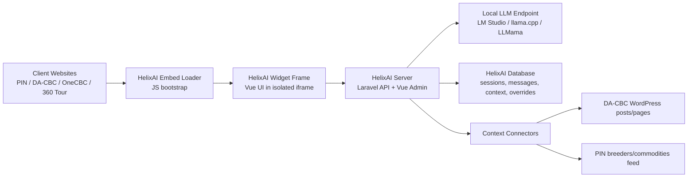

# HelixAI Standalone Rebuild Guide

Use this document as the build spec for rebuilding the current CBC PIN AI chat module into a standalone Laravel + Vue application named `HelixAI`.

The result must be:

- a standalone app hosted on the local server at `192.168.36.10`
- embeddable into multiple client websites with different frontend stacks
- visually identical to the current CBC PIN floating chatbox
- secure enough to avoid turning the local LLM into an open public relay
- able to ingest context from:
  - `dacbc.philrice.gov.ph` WordPress articles
  - `pin.philrice.gov.ph` breeder and commodity data
- able to serve:
  - `pin.philrice.gov.ph`
  - `dacbc.philrice.gov.ph`
  - `onecbc.philrice.gov.ph`
  - `cbc360tour.philrice.gov.ph`
- equipped with an admin console to review recent queries, refine answers, and reuse approved answers when the same or very similar question is asked again

## 1. Reference Implementation in This Repo

These files are the visual and behavioral source of truth for the current chat module:

- `app/Http/Controllers/OpenAi/AiChatController.php`
- `config/openai.php`
- `routes/components/OpenAiRoutes.php`
- `resources/js/Pages/OpenAi/AiChat/AiChat.vue`
- `resources/js/Pages/OpenAi/infrastructure/OpenAiApiService.ts`
- `resources/js/Modules/core/infrastructure/ApiService.ts`
- `resources/js/Layouts/AppLayout.vue`
- `resources/js/Layouts/PageLayout.vue`
- `tailwind.config.js`

Use those files as the exact behavior/design baseline, but do not keep the chat embedded directly inside each host application. Rebuild it as a separate service.

## 2. Non-Negotiable Constraints

- Keep Laravel + Vue as the core stack.
- Follow the same backend design style used in this repo:
  - controllers extend `BaseController` where appropriate
  - persistence logic lives in repository/service classes
  - request validation lives in request classes
  - reusable filtering follows the `AbstractRepoService` / `FilterPipeline` style
  - frontend should keep the current `domain / dto / infrastructure / presentation` separation where practical
- Preserve the current chatbox design exactly unless a setting is explicitly made configurable.
- Do not require host websites to share the same framework.
- Do not expose the LLM endpoint directly to public browsers.
- Do not trust browser-only controls as the only security layer.

## 3. Critical Deployment Reality

Do not directly embed `http://192.168.36.10` from public HTTPS sites.

Why:

- browsers block `http://` resources inside `https://` pages as mixed content
- public users cannot normally reach a private `192.168.x.x` address from the internet

Required deployment shape:

- run the HelixAI app on `192.168.36.10`
- publish it through a reverse proxy with TLS, for example:
  - `https://helixai.philrice.gov.ph`
- only the reverse proxy should be internet-facing
- the raw local app and raw LLM port should stay private on the LAN

If the project is intended for internal-only users on the same network, that is different, but for the listed public sites the reverse-proxy/TLS layer is mandatory.

## 4. Recommended High-Level Architecture



## 5. What to Build

Build one standalone system with three surfaces:

1. `Widget`
   A floating chat UI rendered from HelixAI itself and embedded into other sites.

2. `Public Chat API`
   The backend endpoint that receives widget questions, pulls context, calls the LLM, and returns the response.

3. `Admin Console`
   A secured Laravel + Vue admin area to review query history, inspect context hits, write refined answers, approve curated overrides, and trigger source syncs.

## 6. Cross-Compatibility Strategy

Do not copy the Vue component into every host repository.

Instead:

- serve a tiny `embed.js` loader from HelixAI
- let that loader inject one fixed-position iframe
- render the actual chat UI inside the iframe

Why this is the correct approach:

- exact visual consistency across Laravel, WordPress, Pano2VR, and any plain HTML site
- host CSS cannot break the widget
- widget CSS cannot break host pages
- easier versioning and rollouts
- easier origin-based security and auditing

### Embed Contract

The host page should only need one script tag:

```html
<script
  src="https://ai.philrice.gov.ph/embed.js"
  data-helixai-site="pin"
  data-helixai-position="bottom-right"
  data-helixai-title="Biotech Assistant"
  defer
></script>
```

The loader should:

- detect the host origin
- request widget config from HelixAI
- receive a short-lived signed widget token
- create the floating iframe
- pass `site_key`, token, and theme settings to the iframe via query string or `postMessage`

## 7. Client Website Matrix

Treat these as embed clients:

- `pin.philrice.gov.ph`
- `dacbc.philrice.gov.ph`
- `onecbc.philrice.gov.ph`
- `cbc360tour.philrice.gov.ph`

Treat these as context sources:

- `pin.philrice.gov.ph`
- `dacbc.philrice.gov.ph`

For now:

- `onecbc.philrice.gov.ph` embeds the widget but does not supply retrieval context
- `cbc360tour.philrice.gov.ph` embeds the widget but does not supply retrieval context

## 8. Exact Chatbox Design Spec

Recreate the current UI exactly.

### Floating Button

- position: `fixed`
- bottom offset: `1.5rem`
- right offset: `1.5rem`
- z-index: `50`
- size: `56px x 56px`
- shape: fully rounded
- background closed state: `#acc638` (`cbc-yellow-green`)
- hover color: `#F7C806` (`cbc-yellow`)
- text closed state: `AI`
- text open state: `x`
- shadow: large floating button shadow
- motion:
  - hover slight lift
  - open/close transition

### Panel

- anchored above button
- mobile width: `22rem`
- small-screen width: `24rem`
- height: `30rem`
- background: white
- corner radius: `1rem`
- border: `2px solid #65e701` (`pin-lime`)
- shadow: strong elevated card shadow
- layout: `header / scrollable messages / footer form`

### Header

- background: `#036701` (`pin-green`)
- white text
- title: `Biotech Assistant`
- subtitle: configurable, default to current behavior
- small green status dot on the right

### Message Area

- background: `#f5f5f5` (`pin-gray`)
- empty-state helper text bubble appears when there are no messages
- user messages:
  - right aligned
  - green bubble
  - white text
- assistant messages:
  - left aligned
  - white bubble
  - gray text
  - subtle border
- keep auto-scroll-to-bottom behavior
- keep typing indicator with three dots

### Footer

- white background
- subtle top border
- one-line input + send button
- helper text below input:
  - configurable disclaimer
  - default: model responses may be inaccurate

### Color Tokens

Use these exact tokens:

```text
cbc-yellow-green: #acc638
cbc-yellow:       #F7C806
pin-green:        #036701
pin-green-dark:   #014001
pin-green-light:  #e6f2e6
pin-lime:         #65e701
pin-gray:         #f5f5f5
```

### Behavioral Rules

- open/close button toggles the widget
- scroll to latest message after every user or assistant message
- disable input while request is in flight
- preserve the current transition feel:
  - panel open: fade + slight upward movement + scale-in
  - typing state: animated dots
- use the same compact bubble proportions as the current component

## 9. Standalone App Structure

Follow the repo's current organization style.

### Backend

```text
app/
  Http/
    Controllers/
      AI/
      Admin/
    Middleware/
    Requests/
      AI/
      Admin/
  Models/
    AI/
  Repository/
    AI/
  Services/
    AI/
  Policies/
```

### Frontend

```text
resources/js/
  Pages/
    AI/
      Widget/
      Admin/
      domain/
      dto/
      infrastructure/
      presentation/
  Components/
  Modules/core/
```

### Routes

```text
routes/
  api.php
  web.php
  components/
    AiWidgetRoutes.php
    AiAdminRoutes.php
    AiIngestionRoutes.php
```

## 10. Core Modules to Implement

Implement the following modules.

### 10.1 Widget Delivery Module

Responsibilities:

- serve `embed.js`
- serve iframe page
- return per-site widget config
- mint a short-lived widget access token after origin validation

Suggested classes:

- `WidgetController`
- `WidgetConfigRepo`
- `WidgetTokenService`
- `EnsureAllowedWidgetOrigin` middleware

### 10.2 Chat Runtime Module

Responsibilities:

- validate incoming chat request
- resolve site scope
- enforce rate limits
- retrieve curated answer override if matched
- retrieve source context
- call LLM
- sanitize answer
- log session and messages

Suggested classes:

- `ChatController`
- `ChatRequest`
- `ChatRepo`
- `ChatSessionRepo`
- `ChatOrchestratorService`
- `ContextRetrievalService`
- `AnswerOverrideService`
- `LlmClientService`
- `ResponseSanitizerService`

### 10.3 Context Ingestion Module

Responsibilities:

- sync DA-CBC content
- sync PIN data
- normalize documents
- chunk content
- index for retrieval
- track sync runs and failures

Suggested classes:

- `ContextSourceController`
- `ContextSourceRepo`
- `WordPressIngestionService`
- `PinIngestionService`
- `DocumentChunkingService`
- `ContextIndexService`
- `SyncRunRepo`

### 10.4 Admin Review Module

Responsibilities:

- show recent questions
- inspect matched context and answer
- write refined answer
- approve refined answer as reusable override
- enable/disable overrides
- monitor sync runs

Suggested classes:

- `AdminChatReviewController`
- `ChatReviewRepo`
- `AnswerOverrideRepo`
- `QueryNormalizationService`
- `SimilarityMatchService`

## 11. Database Design

Create migrations for at least these tables.

### 11.1 `ai_sites`

Stores each client website.

Fields:

- `id`
- `site_key` unique, e.g. `pin`, `dacbc`, `onecbc`, `cbc360tour`
- `name`
- `base_url`
- `allowed_origins` JSON
- `theme_settings` JSON
- `is_active`
- timestamps

### 11.2 `ai_widget_sessions`

Tracks widget sessions.

Fields:

- `id`
- `uuid`
- `site_id`
- `origin`
- `ip_hash`
- `user_agent_hash`
- `started_at`
- `last_seen_at`
- timestamps

Do not store raw IP unless there is a strong operational reason.

### 11.3 `ai_chat_messages`

Stores question/answer exchanges.

Fields:

- `id`
- `session_id`
- `site_id`
- `role`
- `content`
- `normalized_content`
- `model`
- `provider`
- `status`
- `response_ms`
- `context_payload` JSON
- `matched_override_id` nullable
- `was_curated_response` boolean
- timestamps

### 11.4 `ai_answer_overrides`

Stores approved refined answers for repeat questions.

Fields:

- `id`
- `site_id` nullable for global override
- `normalized_question`
- `question_variants` JSON
- `answer`
- `answer_source_notes`
- `context_document_ids` JSON
- `similarity_threshold` nullable
- `is_active`
- `approved_by`
- `approved_at`
- timestamps

Behavior:

- exact normalized match should be checked first
- optional semantic/near-match can be checked second
- if matched, return the curated answer directly or inject it as highest-priority context

### 11.5 `ai_context_sources`

Stores source definitions.

Fields:

- `id`
- `source_key` unique
- `name`
- `type` enum: `wordpress`, `pin_api`, `pin_db`
- `base_url` nullable
- `auth_config` JSON encrypted if needed
- `sync_settings` JSON
- `is_active`
- timestamps

### 11.6 `ai_context_documents`

One row per synced article, commodity profile, breeder profile, or record.

Fields:

- `id`
- `source_id`
- `external_id`
- `document_type`
- `title`
- `canonical_url`
- `summary`
- `body_text`
- `metadata` JSON
- `content_hash`
- `published_at`
- `last_synced_at`
- `is_active`
- timestamps

### 11.7 `ai_context_chunks`

Chunked retrieval units.

Fields:

- `id`
- `document_id`
- `chunk_index`
- `content`
- `metadata` JSON
- `embedding` nullable
- timestamps

### 11.8 `ai_sync_runs`

Tracks ingestion runs.

Fields:

- `id`
- `source_id`
- `status`
- `started_at`
- `finished_at`
- `records_seen`
- `records_changed`
- `error_summary`
- timestamps

## 12. Retrieval and Answer Flow

The runtime flow must be:

1. validate widget token, site key, origin, and request payload
2. enforce rate limits
3. normalize the user question
4. check `ai_answer_overrides` for exact normalized match
5. if exact match exists, return curated answer immediately
6. otherwise retrieve top context chunks from local indexed sources
7. build the prompt with:
   - system instructions
   - site scope
   - retrieved context snippets
   - safety rules
8. call the local LLM endpoint
9. sanitize/trim the answer
10. log the exchange
11. return answer + optional citations

### Retrieval Priority

Use this order:

1. approved override answer
2. WordPress/PIN context retrieved from local index
3. model-only answer only if the question is inside allowed domain

### Matching Rules for Curated Answers

Use:

- exact normalized question match first
- then optional fuzzy/semantic match

Normalization should include:

- lowercase
- trim whitespace
- collapse punctuation
- remove duplicate spaces
- optionally singular/plural normalization

Do not let broad overrides accidentally hijack unrelated questions.

## 13. Context Source Details

### 13.1 DA-CBC WordPress Source

Preferred source:

- WordPress REST API

Suggested endpoints:

- `/wp-json/wp/v2/posts`
- `/wp-json/wp/v2/pages`

Ingest:

- only published content
- title
- slug
- permalink
- published and modified timestamps
- excerpt
- article content converted to safe plain text
- tags/categories where useful

Rules:

- strip HTML safely
- preserve headings and paragraphs in readable text form
- ignore theme markup noise
- keep the public article URL for citations

### 13.2 PIN Source

Do not scrape rendered HTML pages.

Preferred source:

- a dedicated internal read-only feed from the PIN app

Recommended approach:

- add secure internal endpoints on `pin.philrice.gov.ph`
- protect them with service token + IP allowlist
- expose only safe retrieval fields

Suggested feeds:

- `/api/internal/ai-context/commodities`
- `/api/internal/ai-context/breeders`

Expose only fields that should be searchable by the AI:

- commodities:
  - `id`
  - `name`
  - `scientific_name`
  - `variety`
  - `accession`
  - `population`
  - `maturity_period`
  - `yield`
  - `description`
  - `regulations`
  - `stress_resilience`
  - `location`
  - `approved_at`
  - breeder name
  - affiliation
- breeders:
  - `id`
  - full name
  - affiliation
  - position
  - expertise
  - research_interest
  - breeder_type
  - linked commodities summary

Do not expose:

- private emails
- personal mobile numbers
- fields not intended for public assistant use

Fallback only if needed:

- read-only DB connector to the PIN database

## 14. Admin Console Requirements

Build a secured admin UI inside the standalone HelixAI app.

### Main Admin Screens

1. `Recent Queries`
   Table of recent user questions and answers.

2. `Query Review`
   Detailed view of one exchange with:
   - raw user question
   - normalized question
   - model answer
   - retrieved context chunks
   - matched site
   - response time
   - whether an override was used

3. `Refine Answer`
   Form to write a better answer and approve it for reuse.

4. `Overrides`
   Table of approved reusable answers.

5. `Sources`
   Source registry and sync status view.

6. `Sync Runs`
   Operational log for ingestion health.

### Admin Actions

Allow admins to:

- search recent queries
- filter by site, date, answered/unanswered, curated/not curated
- mark a question as reviewed
- author a refined answer
- attach related context documents to that refined answer
- add alternate phrasings for matching
- approve or disable an override
- force a resync of WordPress or PIN sources

### Recommended UI Pattern

Reuse the repo's current admin style:

- Vue admin screens
- existing table patterns similar to `CRCMDatatable`
- route/endpoint constants similar to `AdminEndpoints.ts`
- form components and modal patterns already used in this codebase

## 15. Security Requirements

This section is mandatory.

### Network Security

- keep the LLM port private
- do not expose the raw LM Studio or llama.cpp server publicly
- only HelixAI should be allowed to call the LLM endpoint
- publish HelixAI through TLS reverse proxy, not direct private IP embeds

### Origin and Embedding Controls

- maintain a per-site allowlist of origins in `ai_sites`
- validate `Origin` and `Referer`
- use short-lived signed widget tokens
- set `Content-Security-Policy` with strict `frame-ancestors` allowlist
- allow iframe embedding only from approved host sites

### API Security

- widget chat endpoint must have dedicated rate limiting
- recommended default:
  - `10` requests per minute per `site + IP/session`
  - `100` requests per hour per `site + IP/session`
- add separate burst protection for token/session bootstrap
- return clean `429` JSON responses

### Logging and Privacy

- do not log raw prompts to generic request logs
- make full prompt/response storage configurable
- default to minimal logging
- hash IP and user agent where feasible
- never ingest or expose private breeder contact data unless explicitly approved

### Source Connector Security

- WordPress source can remain read-only if public
- PIN source should use service-to-service authentication
- encrypt stored source credentials/tokens
- IP allowlist the connector if possible

### Output Safety

- sanitize model output
- cap max prompt length and max completion length
- define domain rules clearly
- strip accidental chain-of-thought or hidden reasoning artifacts
- return a clean fallback answer on provider failure

## 16. Backend API Surface

Suggested endpoints:

### Public Widget Endpoints

- `GET /embed.js`
- `GET /widget/frame`
- `POST /api/widget/bootstrap`
- `POST /api/widget/chat`

### Admin Endpoints

- `GET /api/admin/queries`
- `GET /api/admin/queries/{id}`
- `POST /api/admin/queries/{id}/refine`
- `POST /api/admin/overrides`
- `PUT /api/admin/overrides/{id}`
- `GET /api/admin/sources`
- `POST /api/admin/sources/{id}/sync`
- `GET /api/admin/sync-runs`

### Internal/Connector Endpoints

- `POST /api/internal/sync/wordpress`
- `POST /api/internal/sync/pin`

## 17. Prompting and Answer Rules

Keep the assistant domain-focused.

Recommended policy:

- answer biotechnology, agriculture, crop improvement, plant breeding, and related PhilRice/CBC/PIN/DA-CBC topics
- answer from retrieved context whenever possible
- if no matching source context exists but the topic is still on-domain, provide a cautious general answer
- if the question is clearly outside domain, return a short refusal
- if a curated override exists, prefer it over model generation

Prompt assembly should include:

- system role
- site identifier
- approved context snippets
- response style instruction
- refusal instruction for out-of-scope topics

## 18. Host Integration Notes by Website Type

### Laravel + Vue Hosts

For:

- `pin.philrice.gov.ph`
- `onecbc.philrice.gov.ph`

Add only the HelixAI loader script to the shared layout. Do not port the widget component into those codebases.

### WordPress Host

For:

- `dacbc.philrice.gov.ph`

Integrate using:

- theme footer injection
- or a tiny custom plugin that prints the embed script site-wide

Do not rely on theme CSS for widget styling.

### Pano2VR Host

For:

- `cbc360tour.philrice.gov.ph`

Use:

- custom HTML overlay
- or injected script block in the generated viewer wrapper

The iframe model is especially important here because the host stack is not Vue-first.

## 19. Build Phases

Implement in this order.

### Phase 1: Scaffold the Standalone App

- create a fresh Laravel + Vue app
- mirror the repo's controller/repo/service/frontend organization
- configure Tailwind with the same design tokens

### Phase 2: Rebuild the Widget UI

- reproduce the current floating chatbox exactly
- serve it from an isolated iframe page
- support open/close, typing state, scrolling, disabled send, and exact spacing/colors

### Phase 3: Rebuild the Chat Backend

- create widget bootstrap endpoint
- create chat endpoint
- create LLM client service
- add response sanitization and domain guard

### Phase 4: Add Security Controls

- origin allowlist
- widget token minting
- CORS restrictions
- rate limiting
- private LLM access
- prompt redaction from general request logs

### Phase 5: Add Query Logging and Admin Review

- save sessions and messages
- build recent queries page
- build review/refine flow
- allow approved answer overrides

### Phase 6: Add Context Ingestion

- WordPress connector
- PIN connector
- chunking and local indexing
- sync history

### Phase 7: Add Retrieval-Augmented Answering

- exact override matching
- local context retrieval
- prompt composition
- citation metadata

### Phase 8: Integrate with Host Sites

- embed loader in each host
- verify origin registration
- verify widget open/close and chat response flow

## 20. Acceptance Criteria

The rebuild is complete only when all of the following are true:

- the widget looks visually identical to the current CBC PIN chatbox
- the widget is loaded from one standalone HelixAI app, not copied into each host codebase
- the widget works on Laravel/Vue, WordPress, and Pano2VR hosts
- the HelixAI server calls the local LLM server without exposing the LLM directly to browsers
- DA-CBC articles are searchable as context
- PIN commodity and breeder data are searchable as context
- admins can review recent queries and approve refined answers
- approved refined answers are reused on repeated questions
- the public chat endpoint is rate-limited
- origin allowlisting and iframe restrictions are enforced
- prompt logging is minimized/redacted by default

## 21. Recommended Defaults

Use these defaults unless overridden by env/config:

```text
APP_NAME=HelixAI
PALAYAI_PUBLIC_URL=https://ai.philrice.gov.ph
PALAYAI_INTERNAL_URL=http://192.168.36.10
LLM_BASE_URL=http://127.0.0.1:1234/v1
LLM_CHAT_MODEL=qwen/qwen3.5-9b
CHAT_RATE_LIMIT_PER_MINUTE=10
CHAT_RATE_LIMIT_PER_HOUR=100
LOG_FULL_CHAT_QUERIES=false
```

## 22. Final Implementation Notes for the Agent

- Preserve the visual design first, then generalize it with config knobs.
- Do not make the widget depend on host CSS, host router, or host JS framework.
- Do not use page scraping for PIN if a secure structured feed can be created.
- Keep the backend modular so more context sources can be added later.
- Start with exact-match curated-answer reuse first, then add semantic reuse only if it does not create false matches.
- Prefer secure and boring integration patterns over clever ones.
